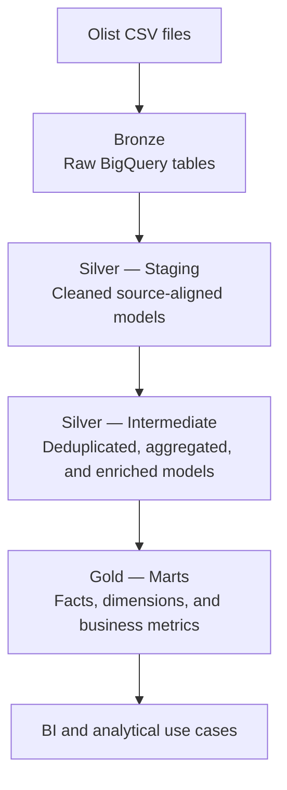

# Olist E-commerce Analytics Engineering Project

Heyo, I was looking for a way to learn more about BigQuery and dbt, so I started building this project using the Brazilian Olist
e-commerce dataset from Kaggle. The project transforms raw data into documented, tested, and analytics-ready models.

The main goal is to learn and design a reliable data pipeline that supports analysis of 
orders, customers, sellers, products, payments, reviews, delivery performance,
and revenue.

> **Project status:** In development. The Bronze and Staging layers are
> complete, and the Intermediate layer is currently being built.

## Project Objectives

- Build a layered ELT pipeline following the Medallion Architecture.
- Preserve raw source data before applying transformations.
- Standardize data types, text fields, timestamps, and business keys.
- Resolve source-data issues such as duplicated geolocation records.
- Control model grain and join cardinality to prevent fanout.
- Create reusable intermediate models for downstream analytics.
- Build dimensional marts for business intelligence and reporting.
- Apply automated data quality tests and model documentation with dbt.

## Dataset

The project uses the
[Brazilian E-Commerce Public Dataset by Olist](https://www.kaggle.com/datasets/olistbr/brazilian-ecommerce),
which contains approximately 100,000 orders placed between 2016 and 2018.

The source includes data about:

- customers;
- orders and order items;
- products and product categories;
- sellers;
- payments;
- customer reviews;
- geolocation.

## Architecture



### Bronze

The raw CSV files are loaded into BigQuery without business transformations.
This layer preserves the original source data and provides a traceable starting
point for the pipeline.

### Silver — Staging

Each source table has a corresponding staging model. This layer:

- casts columns to appropriate BigQuery data types;
- standardizes column names;
- trims and normalizes text values;
- removes accents from city names;
- validates accepted values and required fields;
- keeps transformations close to the source.

### Silver — Intermediate

Intermediate models combine, deduplicate, aggregate, and enrich staging data
before it is consumed by the analytical layer.

Examples include:

- consolidating geolocation to one row per ZIP code prefix;
- enriching customers and sellers with geographic coordinates;
- translating product categories;
- aggregating item and payment metrics at order grain;
- deduplicating order reviews;
- creating an enriched order-level dataset.

### Gold — Marts

The Gold layer will expose business-oriented fact and dimension models for
analytics and BI. It will support topics such as revenue, order volume,
customer behavior, seller performance, product performance, payment methods,
reviews, freight, and delivery performance.

## Data Modeling Principles

The project follows a few core modeling rules:

- Every model has an explicitly defined grain.
- Joins are validated before implementation.
- One-to-many relationships are aggregated before joining to order-level
  models.
- `LEFT JOIN` is used when unmatched source records must be preserved.
- Known source-data limitations are documented instead of hidden.
- `DISTINCT` is not used as a shortcut to conceal fanout or modeling errors.
- Reusable transformations are separated from business-facing marts.

## Repository Structure

```text
olist_ecom/
├── README.md
├── .gitignore
└── dbt_olist/
    ├── dbt_project.yml
    ├── packages.yml
    ├── models/
    │   ├── staging/
    │   │   ├── _staging__models.yml
    │   │   ├── _sources.yml
    │   │   ├── stg_customers.sql
    │   │   ├── stg_geolocation.sql
    │   │   ├── stg_order_items.sql
    │   │   ├── stg_order_payments.sql
    │   │   ├── stg_order_reviews.sql
    │   │   ├── stg_orders.sql
    │   │   ├── stg_products.sql
    │   │   ├── stg_product_category_name_translation.sql
    │   │   └── stg_sellers.sql
    │   ├── intermediate/
    │   │   ├── intermediate__models.yml
    │   │   ├── customers/
    │   │   ├── geolocation/
    │   │   ├── orders/
    │   │   ├── products/
    │   │   └── sellers/
    │   └── marts/
    │       ├── dimensions/
    │       └── facts/
    ├── macros/
    ├── seeds/
    ├── snapshots/
    └── tests/
```

Generated folders such as `target/`, `logs/`, and `dbt_packages/` are excluded
from version control.

## Model Progress

### Staging

All source-aligned staging models have been completed.

### Intermediate

| Model | Purpose | Status |
| --- | --- | --- |
| `int_geolocation__aggregated` | Selects the most frequent city/state pair and median coordinates per ZIP code prefix | Complete |
| `int_products__translated` | Enriches products with translated category names | Complete |
| `int_customers__enriched` | Adds geographic coordinates to customer records | Complete |
| `int_sellers__enriched` | Adds geographic coordinates to seller records | Planned |
| `int_order_payments__aggregated` | Aggregates payment metrics to one row per order | Complete |
| `int_order_reviews__deduplicated` | Resolves duplicated or repeated review records | Planned |
| `int_order_items__enriched` | Enriches order items with product and seller attributes | Planned |
| `int_order_items__aggregated` | Aggregates item, product, seller, freight, and value metrics per order | Complete |
| `int_orders__enriched` | Produces the central enriched order-level model | Planned |

### Marts

Fact tables, dimensions, business metrics, and BI outputs will be added after
the Intermediate layer is complete.

## Data Quality

Data quality is enforced through dbt tests and validation queries. Current
checks include:

- uniqueness and non-null tests for model keys;
- accepted-value tests for Brazilian state codes and categorical fields;
- relationship and cardinality validation before joins;
- comparison of row counts before and after transformations;
- grain validation using total and distinct key counts;
- explicit validation of expected nullable fields;
- checks for partially missing coordinate pairs.

### Examples of Data Issues Addressed

- More than one geolocation record may exist for the same ZIP code prefix.
- The same customer can have multiple order-specific `customer_id` values while
  sharing one `customer_unique_id`.
- Some customer and seller ZIP code prefixes have no geolocation match.
- Orders may contain multiple items, sellers, products, and payment records.
- Invalid or unavailable values are preserved as documented nulls when
  appropriate.

## Tech Stack

- **Data warehouse:** Google BigQuery
- **Transformation:** dbt
- **Language:** SQL
- **Version control:** Git and GitHub
- **Source data:** CSV files from Kaggle
- **Planned analytics layer:** Power BI

## Running the Project

### Prerequisites

- Access to a Google Cloud project with BigQuery enabled
- A configured dbt profile
- The Olist source tables loaded into the Bronze dataset

### Install dependencies

```bash
dbt deps
```

### Validate the connection

```bash
dbt debug
```

### Build the project

```bash
dbt build
```

To build a specific model and its tests:

```bash
dbt build --select model_name
```

## Roadmap

- [x] Load the raw Olist datasets into BigQuery
- [x] Build and test the Staging layer
- [ ] Complete the Intermediate layer
- [ ] Build dimensional facts and dimensions
- [ ] Add business-level metrics and analyses
- [ ] Build a Power BI dashboard
- [ ] Add final architecture and lineage documentation
