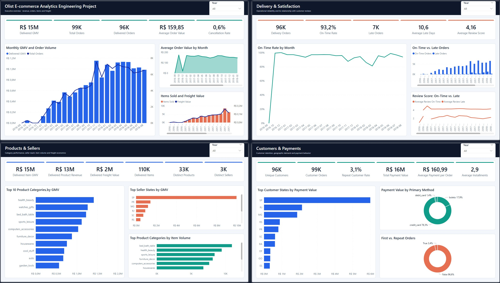
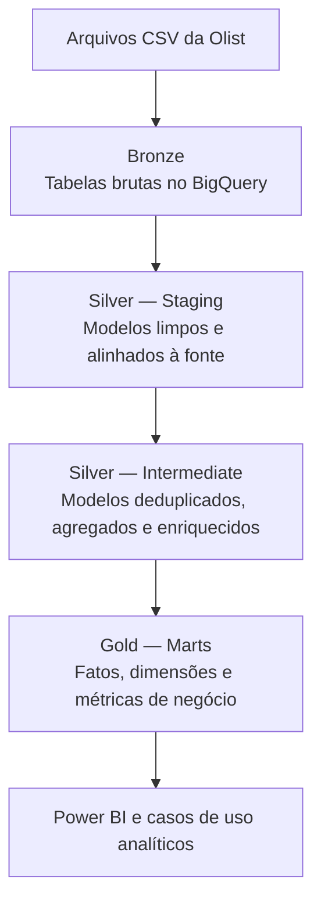
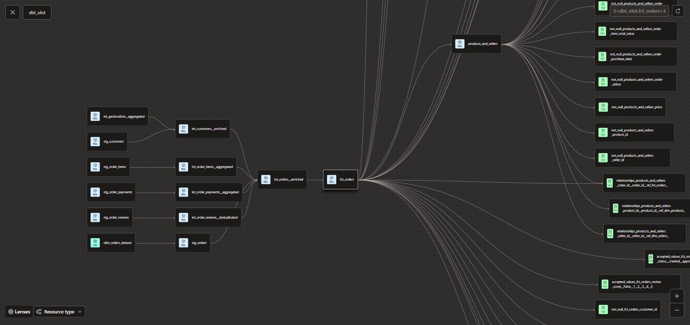

<p align="right">
  <strong>🇧🇷 Português</strong> |
  <a href="README.md">🇺🇸 English</a>
</p>

# Projeto de Analytics Engineering com Olist E-commerce

Este projeto nasceu do objetivo de aprofundar meus conhecimentos em BigQuery e dbt por meio da construção de um pipeline de dados utilizando o dataset público de e-commerce da Olist, disponibilizado no Kaggle. O pipeline transforma dados brutos em modelos documentados, testados e prontos para análise.

O objetivo principal é projetar um pipeline de dados confiável que ofereça suporte a análises de pedidos, clientes, vendedores, produtos, pagamentos, avaliações, desempenho de entregas e receita.

> **Status do projeto:** Em desenvolvimento. As camadas Bronze, Staging, Intermediate e Marts, incluindo os modelos destinados à visualização, estão concluídas. Todos os modelos e testes declarados passam no `dbt build`. O dashboard no Power BI está em desenvolvimento.

## Objetivos do projeto

- Construir um pipeline ELT em camadas seguindo a Arquitetura Medalhão.
- Preservar os dados brutos antes da aplicação de transformações.
- Padronizar tipos de dados, campos de texto, timestamps e chaves de negócio.
- Resolver problemas dos dados de origem, como registros duplicados de geolocalização.
- Controlar o grão dos modelos e a cardinalidade dos joins para evitar fanout.
- Criar modelos intermediários reutilizáveis para análises posteriores.
- Construir fatos, dimensões e modelos orientados a casos de negócio.
- Aplicar testes automatizados de qualidade e documentação dos modelos com dbt.

## Dataset

O projeto utiliza o
[Brazilian E-Commerce Public Dataset by Olist](https://www.kaggle.com/datasets/olistbr/brazilian-ecommerce),
que contém aproximadamente 100 mil pedidos realizados entre 2016 e 2018.

A fonte inclui dados sobre:

- clientes;
- pedidos e itens de pedidos;
- produtos e categorias de produtos;
- vendedores;
- pagamentos;
- avaliações de clientes;
- geolocalização.

## Power BI



- Overview - revenue, orders, items and freight
- Products & Sellers - category performance, seller reach, item volume and freight economics
- Delivery & Satisfaction - operational reliability and its relationship with customer reviews
- Customers & Payments - customer retention, geographic demanda and payment behavior

## Arquitetura



### Bronze

Os arquivos CSV brutos são carregados no BigQuery sem transformações de negócio. Essa camada preserva os dados originais e fornece um ponto inicial rastreável para o pipeline.

### Silver — Staging

Cada tabela de origem possui um modelo de staging correspondente. Essa camada:

- converte as colunas para tipos de dados apropriados no BigQuery;
- padroniza os nomes das colunas;
- remove espaços desnecessários e normaliza valores textuais;
- remove acentos dos nomes das cidades;
- valida valores aceitos e campos obrigatórios;
- mantém as transformações próximas da estrutura da fonte.

### Silver — Intermediate

Os modelos intermediários combinam, deduplicam, agregam e enriquecem os dados de staging antes do consumo pela camada analítica.

Alguns exemplos:

- consolidação da geolocalização em uma linha por prefixo de CEP;
- enriquecimento de clientes e vendedores com coordenadas geográficas;
- tradução das categorias de produtos;
- agregação de métricas de itens e pagamentos no grão de pedido;
- deduplicação das avaliações dos pedidos;
- criação de um conjunto de dados enriquecido no nível do pedido.

### Gold — Marts

A camada Gold disponibiliza fatos, dimensões e modelos orientados a casos de negócio para consumo analítico e visualização. Ela oferece suporte a análises de receita, volume de pedidos, comportamento de clientes, desempenho de vendedores e produtos, formas de pagamento, avaliações, frete e desempenho de entregas.

## Princípios de modelagem

O projeto segue algumas regras centrais:

- Cada modelo possui um grão explicitamente definido.
- Os joins são validados antes da implementação.
- Relações de um para muitos são agregadas antes de serem conectadas a modelos no grão de pedido.
- `LEFT JOIN` é utilizado quando registros sem correspondência precisam ser preservados.
- Limitações conhecidas dos dados de origem são documentadas, e não ocultadas.
- `DISTINCT` não é utilizado como atalho para esconder fanout ou erros de modelagem.
- Transformações reutilizáveis são separadas dos marts voltados ao negócio.

## Estrutura do repositório

```text
olist_ecom/
├── README.md
├── .gitignore
├── powerbi/
└── dbt_olist/
    ├── dbt_project.yml
    ├── packages.yml
    ├── assets/
    ├── models/
    │   ├── staging/
    │   ├── intermediate/
    │   │   ├── intermediate__models.yml
    │   │   ├── customers/
    │   │   ├── geolocation/
    │   │   ├── orders/
    │   │   ├── products/
    │   │   └── sellers/
    │   └── marts/
    │       ├── dimensions/
    │       └── facts/
    │       └── dataviz/    
    ├── macros/
    ├── seeds/
    ├── snapshots/
    └── tests/
```

Pastas geradas automaticamente, como `target/`, `logs/` e `dbt_packages/`, são excluídas do controle de versão.

## Linhagem de Dados

A linhagem abaixo apresenta o fluxo dos dados desde as fontes brutas no BigQuery, passando pelas camadas Staging e Intermediate, até os marts Gold e modelos analíticos.



## Qualidade dos dados

A qualidade dos dados é aplicada por meio de testes do dbt e consultas de validação. As verificações incluem:

- testes de unicidade e valores não nulos para as chaves dos modelos;
- testes de valores aceitos para UFs brasileiras e campos categóricos;
- validação de relacionamentos e cardinalidade antes dos joins;
- comparação da quantidade de linhas antes e depois das transformações;
- validação do grão por meio da comparação entre contagem total e chaves distintas;
- validação explícita de campos em que valores nulos são esperados;
- verificações de pares de coordenadas parcialmente ausentes.

## Documentação e lineage

As descrições dos modelos e colunas, os testes e os relacionamentos são declarados nos arquivos YAML do projeto. As funções `source()` e `ref()` permitem ao dbt construir automaticamente o lineage entre as camadas Bronze, Silver e Gold.

No dbt Fusion, a documentação local pode ser gerada e visualizada com:

```bash
dbt compile --write-index --write-catalog
dbt docs serve
```

Os artefatos gerados ficam em `target/` e não são versionados, pois podem ser reproduzidos a partir do código do projeto.

## Tecnologias

- **Data warehouse:** Google BigQuery
- **Transformação e modelagem:** dbt Fusion
- **Linguagem:** SQL
- **Visualização:** Power BI
- **Controle de versão:** Git e GitHub
- **Dados de origem:** arquivos CSV do Kaggle

## Como executar o projeto

### Pré-requisitos

- Acesso habilitado ao BigQuery
- Perfil do dbt configurado
- Tabelas de origem da Olist carregadas no dataset Bronze

### Instalar dependências

```bash
dbt deps
```

### Validar a conexão

```bash
dbt debug
```

### Construir o projeto

```bash
dbt build
```

Para construir um modelo específico e executar seus testes:

```bash
dbt build --select model_name
```

## Roadmap

- [x] Carregar os datasets brutos da Olist no BigQuery
- [x] Construir e testar a camada Staging
- [x] Concluir a camada Intermediate
- [x] Construir fatos e dimensões
- [x] Adicionar métricas e modelos orientados a casos de negócio
- [x] Adicionar testes e documentação dos modelos
- [x] Construir o dashboard no Power BI
- [x] Adicionar imagens finais da arquitetura, do lineage e do dashboard